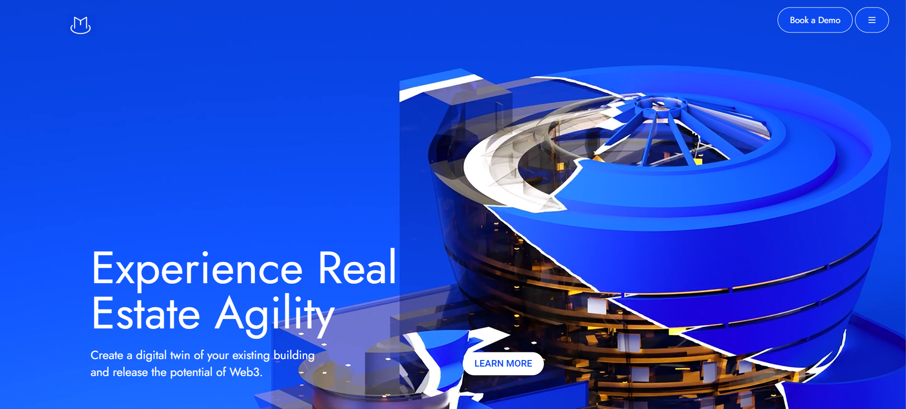

# Magma - Web3 Real Estate Platform Landing Page





A modern, interactive single-page website for Magma - a Web3 platform that creates Digital Twin Tokens (DTT®) for real estate buildings. Features smooth scrolling animations, canvas-based image sequences, and a stunning visual experience.

## 🚀 Features

- **Smooth Scrolling**: Powered by Locomotive Scroll for fluid navigation
- **Canvas Animations**: Three interactive canvas sections with scroll-triggered image sequences
- **GSAP Animations**: Rich animations using GreenSock Animation Platform (GSAP) with ScrollTrigger
- **Responsive Design**: Viewport-based units for optimal viewing across devices
- **Video Backgrounds**: Engaging video elements in hero and showcase sections
- **Interactive Buttons**: Functional navigation buttons for smooth page scrolling

## 🛠️ Technologies Used

- **HTML5** - Structure and content
- **CSS3** - Styling and animations
- **JavaScript (Vanilla)** - Interactive functionality
- **Locomotive Scroll v3.5.4** - Smooth scrolling library
- **GSAP v3.12.5** - Animation library
  - ScrollTrigger plugin
- **RemixIcon v4.5.0** - Icon library
- **Canvas API** - Image sequence animations

## 📁 Project Structure

```
Magma/
├── index.html              # Main HTML file (14 sections/pages)
├── script.js               # JavaScript functionality (~730 lines)
├── style.css               # Stylesheet (~550 lines)
├── README.md               # This file
└── assets/
    ├── fonts/
    │   ├── jost-variable.ttf
    │   ├── KFOLCnqEu92Fr1MmEU9fBBc4 (1).ttf
    │   └── KFOmCnqEu92Fr1Mu4mxK (1).ttf
    ├── images/
    │   ├── logo.png
    │   ├── bridges*.png     # 50+ bridge animation frames
    │   └── frames*.png      # 67+ frame animation frames
    └── logo.png
```

## 🎯 Setup Instructions

### Prerequisites
- A modern web browser (Chrome, Firefox, Safari, Edge)
- A local web server (optional, but recommended)

### Installation

1. **Clone or download the repository**
   ```bash
   cd Magma
   ```

2. **Open with a local server** (recommended)

   **Option A: Using Python**
   ```bash
   # Python 3
   python -m http.server 8000
   
   # Python 2
   python -m SimpleHTTPServer 8000
   ```

   **Option B: Using Node.js (http-server)**
   ```bash
   npx http-server -p 8000
   ```

   **Option C: Using VS Code Live Server**
   - Install the "Live Server" extension
   - Right-click on `index.html` and select "Open with Live Server"

3. **Access the website**
   - Open your browser and navigate to `http://localhost:8000`

### Direct File Access
You can also open `index.html` directly in your browser, but some features may not work correctly due to CORS restrictions with local files.

## 📄 Page Sections

The website consists of 14 main sections:

1. **Page 1** - Hero section with video background and navigation
2. **Page 2** - Introduction to Digital Twin Tokens
3. **Page 3** - First canvas animation (frames sequence)
4. **Page 4** - Stakeholder connectivity information
5. **Page 5** - Second canvas animation (bridges sequence)
6. **Page 6** - Value proposition section
7. **Page 7** - Third canvas animation (lore sequence with circular overlay)
8. **Page 8** - Magma DTT showcase with video
9. **Page 9** - "What is Magma?" section
10. **Page 10** - Detailed feature descriptions
11. **Page 11** - Recent blog posts
12. **Page 12** - Featured in section
13. **Page 13** - Call-to-action (Become an early adopter)
14. **Page 14-15** - Social media links and footer

## 🎨 Key Features Explained

### Canvas Animations
Three sections use canvas-based image sequences that animate based on scroll position:
- **Page 3**: 67 frames from local images
- **Page 5**: 67 bridge animation frames from local images  
- **Page 7**: 136 frames loaded from external URLs (webp format)

### Button Functionality
- **"Book a Demo" / "BOOK A DEMO"** - Scrolls to page 13 (contact section)
- **"LEARN MORE" / "Learn More"** - Scrolls to page 10 (features section)
- **Social Media Links** - Opens respective social platforms in new tabs

### Smooth Scrolling
The entire page uses Locomotive Scroll for smooth, momentum-based scrolling that enhances user experience.

## 🔧 Customization

### Changing Colors
Main color scheme is defined in `style.css`:
- Primary blue: `#1137ca`, `#0a3cce`, `#0b48ed`
- Background: `#02268e`, `#0a3cce`
- Text: `#fff` (white)

### Modifying Animations
Animation settings can be adjusted in `script.js`:
- Scroll trigger points
- Animation duration and easing
- Canvas frame sequences

### Adding Content
To add new sections, follow the existing page structure:
```html
<div id="pageX">
    <!-- Your content -->
</div>
```

Then add corresponding styles in `style.css` and animations in `script.js` if needed.

## ⚠️ Known Issues & Notes

1. **External Resources**: Some images and videos are loaded from external URLs (`thisismagma.com`). These may not load if the URLs are unavailable.

2. **Browser Compatibility**: Some features may require modern browsers with Canvas API and ES6 support.

3. **Mobile Optimization**: While responsive, some animations may perform differently on mobile devices.

4. **Image Loading**: Error handling has been added, but ensure all local images in the `assets/images/` folder are present for animations to work correctly.

## 🐛 Troubleshooting

### Images not loading
- Check that all image files exist in the `assets/images/` folder
- Verify image paths are correct (should be `assets/images/...`, not `.assets/images/...`)
- Check browser console for specific error messages

### Animations not working
- Ensure GSAP and Locomotive Scroll libraries are loaded
- Check browser console for JavaScript errors
- Verify that ScrollTrigger is properly registered

### Fonts not displaying
- Confirm font files exist in `assets/fonts/` folder
- Check font paths in `style.css`

## 📝 License

This project is a landing page implementation. External resources (videos, some images) are property of Magma/thisismagma.com.

**Note**: Footer states "© All rights belong to Me, Ofcourse!" - Update this with proper attribution if needed.

## 🤝 Contributing

This appears to be a portfolio/educational project. If you'd like to contribute:
1. Fix any bugs you encounter
2. Improve animations and performance
3. Add new features or sections
4. Optimize for mobile devices

## 📞 Contact

For questions about Magma platform, visit [thisismagma.com](https://thisismagma.com)

---

**Last Updated**: 2025
**Version**: 1.0

